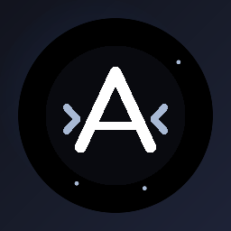
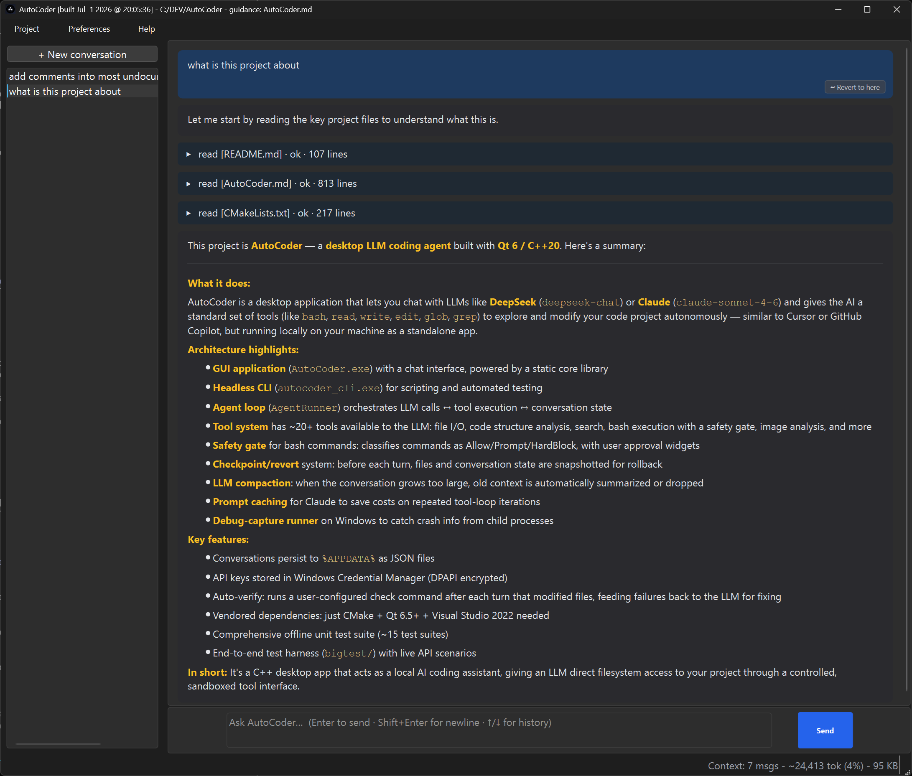
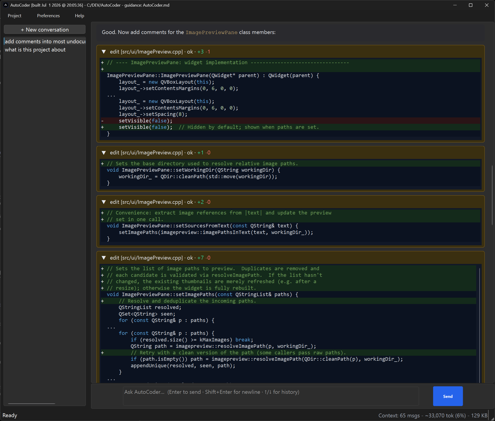

<p align="center">
  
</p>

# AutoCoder

A Qt 6 / C++20 **desktop LLM coding agent** for Windows. Chat with **DeepSeek** (`deepseek-chat`) or **Claude** (`claude-sonnet-4-6`) and watch it use a set of tools (`bash`, `read`, `write`, `edit`, `glob`, `grep`, and more) to explore and modify your project — Cursor / Copilot style, but running locally as a standalone app.

What sets AutoCoder apart is **how it runs commands**: instead of shelling out to your system shell (Git Bash / cmd / WSL), the `bash` tool runs through AutoCoder's own internal cross-platform shell, and **every command passes a safety gate** that tries to keep the agent from performing uncontrolled or destructive operations — running known-safe commands silently, pausing for your approval on anything risky, and hard-blocking the catastrophic ones outright.

## Screenshots

Asking about an unfamiliar project — the agent reads key files (collapsible tool calls) and answers in a formatted, syntax-colored bubble:



Editing code — `edit` results render as inline **colored diffs** with syntax highlighting and `+added / -removed` line counts:



## ⚠️ Safety & Disclaimer

**AutoCoder is an autonomous coding agent. It runs shell commands and modifies your filesystem on its own** — it can create, modify, and **delete** files. The command safety gate (below) is designed to reduce risk, not eliminate it. Although AutoCoder does its best to confine changes to the project folder you open, **files outside the working folder could still be modified or deleted**, and a small risk of unintended changes always remains.

**Do not run AutoCoder in an open or unprotected environment.** Run it against a disposable or backed-up working copy, and ideally inside an isolated environment — a virtual machine, container, or a dedicated user account with limited permissions. Review the agent's actions, and keep your important data backed up.

AutoCoder is provided **"as is", without warranty of any kind** (see [LICENSE](LICENSE)). You use it at your own risk.

## Highlights

- **Internal shell with a command safety gate** — `bash` is executed by AutoCoder's own deterministic shell (a command parser, common built-ins, and a `QProcess` runner), not an external shell. Each command is classified **Allow / Prompt / HardBlock**: known-safe, in-folder, reversible commands run silently; unknown, capability-granting, or destructive commands pause for explicit approval; catastrophic / irreversible ones are refused even with consent. There's a first-run consent step and a per-command "always allow" list (matched on the full exact command, never a prefix).
- **Two providers, one format** — Claude requests/responses are adapted to and from AutoCoder's internal OpenAI-style conversation format, so the agent loop, persistence, and tools stay provider-neutral. Claude also gets automatic **prompt caching** to cut cost and latency across tool-loop iterations; DeepSeek caches server-side.
- **Checkpoint & one-click revert** — every turn snapshots the conversation and the files it modified; "Revert to here" restores both.
- **Repo-map context** — a compact map of the project (files + top-level symbols) is injected into the system prompt, so the agent skips most discovery round-trips at the start of a task.
- **Rich chat UI** — colored syntax highlighting and inline **colored diffs** for `edit` / `write`, collapsible tool-call results, and a dark theme.
- **Auto-verify** — configure a check command (build/test); it runs after any turn that changed files, and failures are fed back to the model to fix (bounded retries).
- **Automatic context management** — LLM-based compaction first, then oldest-exchange trimming, keeps long sessions within the token budget.
- **Resilient** — a crash handler writes stack traces to disk, and transient streaming/network errors auto-retry.
- **Lean to build** — CMake + Qt; the only vendored dependency is header-only `nlohmann/json`. Ships with an offline unit-test suite and a live-API end-to-end harness.

## Build

Prerequisites:

- CMake >= 3.21
- Visual Studio 2022 (with the "Desktop development with C++" workload)
- Qt 6.5+ for MSVC 2022 (the default preset expects `C:/Qt/6.8.3/msvc2022_64`)

If you don't have Qt installed:

```sh
pip install --user aqtinstall
python -m aqt install-qt windows desktop 6.8.3 win64_msvc2022_64 -O C:/Qt
```

Then configure and build:

```sh
cmake --preset default
cmake --build --preset default
```

`nlohmann/json` is vendored under `third_party/nlohmann/json.hpp`; no package manager required.

If your Qt install is somewhere else, override:

```sh
cmake --preset default -DCMAKE_PREFIX_PATH="C:/path/to/Qt/6.x.y/msvc2022_64"
```

To run the offline unit tests (no network / API key / UI needed):

```sh
cmake --build --preset default --target autocoder_tests
./build/default/Debug/autocoder_tests.exe          # all suites; append a suite name to run one
```

## Run

The desktop app:

```sh
./build/default/Debug/AutoCoder.exe
```

On first run it will prompt for an API provider, key, and model (`Preferences -> Settings...` to change later). The model field lists the main known DeepSeek and Claude IDs and remains editable for any account-enabled model ID. Claude uses a lower default context budget than DeepSeek to avoid Anthropic input-token-per-minute rate limits during tool loops. Alternatively set `DEEPSEEK_API_KEY` or `ANTHROPIC_API_KEY` in the environment before launch.

Open a project folder via **Project -> Open folder...**, then ask AutoCoder anything in the composer at the bottom (Ctrl+Enter to send).

### CLI harness

A headless CLI exists for scripting / debugging:

```sh
DEEPSEEK_API_KEY=sk-... ./build/default/Debug/autocoder_cli.exe \
    --project C:/DEV/SomeProject \
    "List the C++ source files and tell me what AgentRunner does."
```

Claude via CLI:

```sh
ANTHROPIC_API_KEY=sk-ant-... ./build/default/Debug/autocoder_cli.exe \
    --provider claude \
    --project C:/DEV/SomeProject \
    "List the C++ source files and tell me what AgentRunner does."
```

## Tools

The LLM is given the following tools. All file paths are resolved inside the open project; write/edit tools refuse to touch a file the model hasn't `read` first, and file visibility honors `.gitignore`, a built-in secret/credential deny-list, and an optional `.autocoderignore`.

| Tool | What it does |
|------|--------------|
| `bash` | Runs a command through AutoCoder's internal cross-platform shell (see the safety gate below). Supports simple commands, common built-ins, small internal pipelines like `wc -l ... \| sort -rn \| head -40`, `;` / `&&` / `\|\|`, `cd`, env vars, recursive large-file scans, and direct execution of programs like `p4`, `cmake`, `npm`, and `python`. Combined stdout+stderr, configurable timeout. |
| `read` | Reads a text file with `cat -n`-style line numbers; `offset` / `limit` for slicing big files. |
| `write` | Writes a file (creating parent dirs). Refuses to overwrite an existing file the model hasn't `read`. |
| `append` | Appends content to a file, with optional `expected_offset` guarding — used after `write` for large generated files that don't fit in one call. |
| `edit` | Exact string-replace in a file. Requires a unique match unless `replace_all: true`. |
| `replace_lines` | Replaces a line range (more robust than `edit` for larger, non-unique edits); reports the new line span. |
| `copy_file` | Byte-for-byte in-project file copy. |
| `glob` | `fnmatch`-style file search (`**/*.cpp`), newest-first. Skips `.git`, `node_modules`, `build`, etc. Accepts `/mnt/c/...`, `/c/...`, and `/cygdrive/c/...` drive aliases on Windows. |
| `ls` | Directory listing. |
| `grep` | Regex content search across files. Uses `rg` if on PATH, else a `std::regex` fallback. |
| `read_outline` | Structural outline of a file (class / function hierarchy) without reading the whole thing. |
| `find_callers` | Finds all call sites of a function. |
| `find_callees` | Finds the calls made inside a symbol / span. |
| `move_span` | Moves a line span between files / locations. |
| `move_func` | Moves a function / method by symbol name. |
| `analyze_image` | Image inspection without vision: validity + header dump for corrupt files, color stats, and an ASCII luminance preview (used to self-verify rendered output). |
| `ask_user` | Pauses the run to ask you a question (free-text or predefined choices). |

### Command safety gate

Because the agent can run arbitrary commands, `bash` calls go through a classifier before executing:

- **Allow** — known-safe, in-folder, reversible commands run silently.
- **Prompt** — the default for anything unknown, plus capability-granting or destructive commands even when they target the project folder. The run pauses and asks you to Allow once / Always allow / Deny.
- **HardBlock** — catastrophic or irreversible commands are refused even if you consent.

Approvals are matched on the **entire** command string, so allowing `build.sh` can never silently whitelist `build.sh && rm -rf ~`.

## Where things live

- Source: `src/` — `agent/`, `llm/`, `tools/` (incl. `tools/shell/`), `ui/`, `persistence/`, `diagnostics/`.
- Settings (provider, API key location, model): platform-standard `QSettings` (Windows registry). API keys themselves are stored in the Windows Credential Manager (DPAPI-encrypted), not in plaintext.
- Conversations: `<Qt AppDataLocation>/projects/<projectKey>/<uuid>.json`; on Windows desktop builds this is normally `%APPDATA%/AutoCoder/AutoCoder/projects/<projectKey>/<uuid>.json`. Each project folder gets its own bucket; `<projectKey>` is the first 32 hex chars of the SHA-1 of the weakly canonical project path. A conversation JSON stores `project_root`, `model`, `messages`, `approvals`, plus metadata such as `id`, `title`, `created_at`, and `updated_at`. New empty conversations live only in memory until the first user message is saved.
- Conversation checkpoints: `<Qt AppDataLocation>/projects/<projectKey>/checkpoints/<conversationId>/<turnIndex>.json`, normally `%APPDATA%/AutoCoder/AutoCoder/projects/<projectKey>/checkpoints/<conversationId>/<turnIndex>.json` on Windows desktop builds. These power "Revert to here" and store the pre-turn conversation snapshot plus base64-encoded pre-images of files modified by that turn.
- Crash logs: appended under the local app data folder, e.g. `%LOCALAPPDATA%/AutoCoder/AutoCoder/logs/crashes.log` (desktop) and `%LOCALAPPDATA%/AutoCoder/autocoder_cli/logs/crashes.log` (CLI). Logs include timestamps, app/Qt/OS metadata, C++ exception details, and on Windows the exception code, registers, and a best-effort stack trace.

## Limitations

- Windows-first: the crash handler, Credential Manager storage, and default Qt path are Windows-specific, though the core is portable Qt/C++.
- No MCP server support and no embeddings / RAG.
- Syntax highlighting covers C/C++ specifically; other languages render as plain (uncolored) monospaced text.

## License

Licensed under the **MIT License** — see [LICENSE](LICENSE).

Bundled third-party code: `third_party/nlohmann/json.hpp` ([nlohmann/json](https://github.com/nlohmann/json)), also MIT-licensed.
